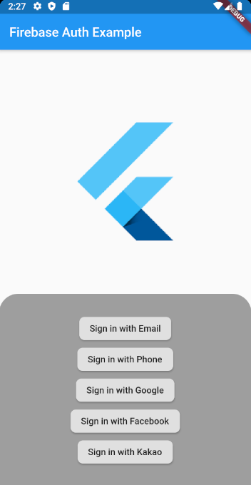
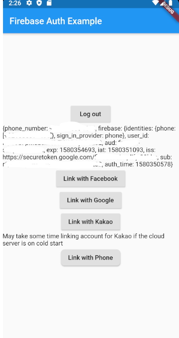

# Firebase Authentication Simplify

A high-level framework of Firebase Auth package that wraps several lines of codes to one line in order to easily use sign-in function.




## Why/Who should use this

You may want to use [firebase_auth](https://pub.dev/packages/firebase_auth) package directly if you need specific customization on sign-in/out logic.      
However, although the most of usecases have almost the same signing-in and out codes, it is pain to write redundant codes everytime even if it is just a several lines of code. Especially, when you provide more than 2 sign-in methods. 

You will basically write some codes like below for **Each** of sign-in methods, and you want to manage it seperatly from the widget you use.

```dart
// Example of Google sign in (What you will do with original packages)

final GoogleSignIn _googleSignIn = GoogleSignIn();
final FirebaseAuth _auth = FirebaseAuth.instance;

Future<FirebaseUser> _handleSignIn() async {
  final GoogleSignInAccount googleUser = await _googleSignIn.signIn();
  final GoogleSignInAuthentication googleAuth = await googleUser.authentication;

  final AuthCredential credential = GoogleAuthProvider.getCredential(
    accessToken: googleAuth.accessToken,
    idToken: googleAuth.idToken,
  );

  final FirebaseUser user = (await _auth.signInWithCredential(credential)).user;
  print("signed in " + user.displayName);
  return user;
}

_handleSignIn()
    .then((FirebaseUser user) => print(user))
    .catchError((e) => print(e));

_handleSignOut() {
    ...
}
```

**This package has nothing fancy but just do the dirty things for you and what you will have is something like:**

```dart
import 'package:firebase_auth_simplify/firebase_auth_simplify.dart';

// Google
FirebaseAuthAPI.signInWith(GoogleSignInAPI());

// Facebook
FirebaseAuthAPI.signInWith(FacebookSignInAPI());

...
```

So if your priority is 'simplicity' and 'less code' for 3rd party integration, it is worth using this package.

## Who should consider NOT using this
Firstly, if your project only uses firebase provided sign-in methods, such as email or phone auth, it is better using [firebase_auth](https://pub.dev/packages/firebase_auth) package directly.

Secondly, as this package includes several 3rd party sign-ins, such as google, facebook and kakao, it contains related packages which you might not need it. For example, even though you only provide email and google sign-in methods to the customer, your project will still contain facebook or other sign-in packages which is not necessary in your case. If the issue matters to you, I recommend using your own way instead of implementing this package

## Currently supporting Sign-ins (X = supporting)
- [X] Email
- [X] Phone
- [X] Google
- [ ] Google Play Games 
- [X] Facebook
- [X] Kakao
- [ ] Apple 
- [ ] GameCenter 
- [ ] Twitter
- [ ] Github

## Support
If the package was useful or saved your time, please do not hesitate to buy me a cup of coffee! ;)  
The more caffeine I get, the more useful projects I can make in the future. 

<a href="https://www.buymeacoffee.com/Oj17EcZ" target="_blank"></a>


## Getting Started

> **** **NOTE: Only setup what you need. No need to configure all of followings** ****

### Firebase Auth Setup
This project uses firebase_auth package and is just a wrapper of it. So please make sure you follow setup instruction of [firebase_auth](https://pub.dev/packages/firebase_auth).

You basically need to [set google services](https://pub.dev/packages/firebase_auth) at Android build.gradle files, and then **you must [add App](https://codelabs.developers.google.com/codelabs/flutter-firebase/index.html#6) at Firebase Console**.

> **NOTE**: If previous setting is not completed you will get an error like below.

> ```
> java.lang.IllegalStateException:
> Default FirebaseApp is not initialized in this process [package name].
> Make sure to call FirebaseApp.initializeApp(Context) first.
> ```

### Google sign in Setup
Import [google_sign_in](https://pub.dev/packages/google_sign_in) package and follow the instruction.

### Facebook sign in Setup
Import [flutter_facebook_login](https://pub.dev/packages/flutter_facebook_login) package and follow the instruction.

> **Note**: Use [openssl-0.9.8e_X64](https://code.google.com/archive/p/openssl-for-windows/downloads) for getting key hash. Otherwise, it will fail to authenticate.    
>       Also, on Windows platform, DO NOT use keytool at powershall using vs code's terminal. Use cmd.

### Kakao sign in Setup
Import [flutter_kakao_login](https://pub.dev/packages/flutter_kakao_login) package and follow the instruction. Steps are similar to Facebook settings.

1. Create an app at kakao developer portal.
2. Set key hash in there. 
> **Note**: Use [openssl-0.9.8e_X64](https://code.google.com/archive/p/openssl-for-windows/downloads) for getting key hash. Otherwise, it will fail to authenticate.    
> Also, on Windows platform, DO NOT use keytool at powershall using vs code's terminal. Use cmd.

For Android,
Set AndroidManfest.xml

For iOS,
Set info.plist and import SDK into xcode before building.

For Firebase,
We need a [cloud function](https://pub.dev/packages/cloud_functions) which creates custom token with kakao access token. Please refer to below documents.
1. [Issue ticket](https://github.com/FirebaseExtended/custom-auth-samples/issues/10) at FirebaseExtended github.
2. [Basic implementation](https://github.com/FirebaseExtended/custom-auth-samples/blob/master/kakao/KakaoLoginServer/app.js) at FirebaseExtended github.
3. [Improved implementation](https://github.com/CoderSpinoza/custom-auth-samples/blob/kakao/update-versions/kakao/KakaoLoginServer/app.js) by CorderSpinoza at github.
4. [Usage of userClaims](https://stackoverflow.com/a/58373886/12567737) at Stackoverflow.
5. npm install --save request request-promise to use 'request-promise module' 
6. **IMPORTANT: Make sure to call 'createCustomToken' with { provider: "kakaocorp.com" } at 2nd parameter. If not, you won't be able to call sign-out for it.**

**Note: Either using config.json file or using config 'firebase functions:config:set kakao.appid=your_kakao_app_id' for cloud function is recommended instead of coding it directely into cloud function code.   
Then, you can decalre like:**
```
const kakaoId = require("./config.json");
const kakaoId = functions.config().kakao.appid;
```

If you encounter below error, follow the link and enable API.
```
{error: {codePrefix: auth, errorInfo: {code: auth/insufficient-permission, message: Identity and Access Management (IAM) API has not been used in project YOUR_PROJECT_ID before or it is disabled. Enable it by visiting https://console.developers.google.com/apis/api/iam.googleapis.com/overview?project=YOUR_PROJECT_ID then retry. If you enabled this API recently, wait a few minutes for the action to propagate to our systems and retry.; Please refer to https://firebase.google.com/docs/auth/admin/create-custom-tokens for more details on how to use and troubleshoot this feature.}}}
```

If you see below error, you also need to set Permission of iam.serviceAccounts.signBolb.
```
{error: {codePrefix: auth, errorInfo: {code: auth/insufficient-permission, message: Permission iam.serviceAccounts.signBlob is required to perform this operation on service account projects/-/serviceAccounts/YOUR_PROJECT_NAME@appspot.gserviceaccount.com.; Please refer to https://firebase.google.com/docs/auth/admin/create-custom-tokens for more details on how to use and troubleshoot this feature.}}}
```
[Grant permission](https://stackoverflow.com/a/54066988/12567737) in console.

Lastly, as this uses external request, you need to **change your plan to 'Blaze'**. Otherwise, you will get 500 error.

## Usage

### Simple Sign-up/in/out
Simply initialize the class you want to sign in for, and call signIn() function.   
**NOTE: If you use it this way, you need to manage 3rd party sign-'out' logic yourself, because ['firebase_auth' package does not support the function](https://github.com/FirebaseExtended/flutterfire/issues/891) yet. It only provides signOut() function for firebase provided auth such as email. You also have to manage linking option yourself.**

#### Sign-Up / Sign-In
```dart
// e-mail
FirebaseEmailAuthAPI(email: inputEmail, password: inputPassword).signUp();
FirebaseEmailAuthAPI(email: inputEmail, password: inputPassword).signIn();

// phone auth
FirebasePhoneAuthAPI phoneAuthAPI = FirebasePhoneAuthAPI();
phoneAuthAPI.verifyNumber(provider.phoneNumber, ....);
phoneAuthAPI.submitVerificationCode(code);
phoneAuthAPI.signIn();

// google
FirebaseGoogleAuthAPI().signIn();
FirebaseGoogleAuthAPI(scopes: ['email', 'https://www.googleapis.com/auth/contacts.readonly']).signIn();

// Kakao 
FirebaseKakaoAuthAPI().signIn();

// Facebook
FirebaseFacebookAuthAPI().signIn();
```

#### Sign-Out
```dart
// Singing out using original package of firebase_auth. 
// IMPORTANT: This will NOT sign out from 3rd party provider
FirebaseAuth.instance.signOut();
```

### Using the wrapper (Recommended)
We provide FirebaseAuthProvider so that we can manage sign-out and 3rd party providers' account linking function for you. 

#### Sign-Up / Sign-In
```dart
FirebaseAuthProvider.instance.signUpWith(FirebaseWhateverAuthAPI());    // Only works with firebase provided auth. (eg. email)
FirebaseAuthProvider.instance.signInWith(FirebaseWhateverAuthAPI()); 
```

*Phone authenticate needs few more lines.*
```dart
FirebasePhoneAuthAPI phoneAuthAPI = FirebasePhoneAuthAPI();
phoneAuthAPI.verifyNumber(provider.phoneNumber, ....);
phoneAuthAPI.submitVerificationCode(provider.code);

FirebaseAuthProvider.instance.signInWith(phoneAuthAPI);
```

#### Sign-Out
``` dart
// Then you can sign-out anywhere. 
FirebaseAuthProvider.instance.signOut();
```
**NOTE: Good thing to use this way is it does not only sign out from Firestore, but also sign out from 3rd party provider which we can allow user to sign-in with another account to the same provider. Also, you can manage account linking easily.**

#### Linking
```dart
FirebaseAuthProvider.instance.linkCurrentUserWith(FirebaseWhateverAuthAPI());
```

*Phone authenticate needs few more lines.*
```dart
final FirebasePhoneAuthAPI phoneAuthAPI = FirebasePhoneAuthAPI(); // Initialize first
phoneAuthAPI.verifyNumber(provider.phoneNumber, ......);          // Send phone number to get code
phoneAuthAPI.submitVerificationCode(code);                        // Submit the 6 digit code

FirebaseAuthProvider.instance.linkCurrentUserWith(phoneAuthAPI);  // Then try link (Will get ERROR_INVALID_VERIFICATION_CODE exception if code is wrong)
```

### Other useful packages you might be instrested
[Material design Speed Dial](https://pub.dev/packages/flutter_speed_dial_material_design)   
[Google Maps Place Picker](https://pub.dev/packages/google_maps_place_picker)

<a href="https://www.buymeacoffee.com/Oj17EcZ" target="_blank"></a>
